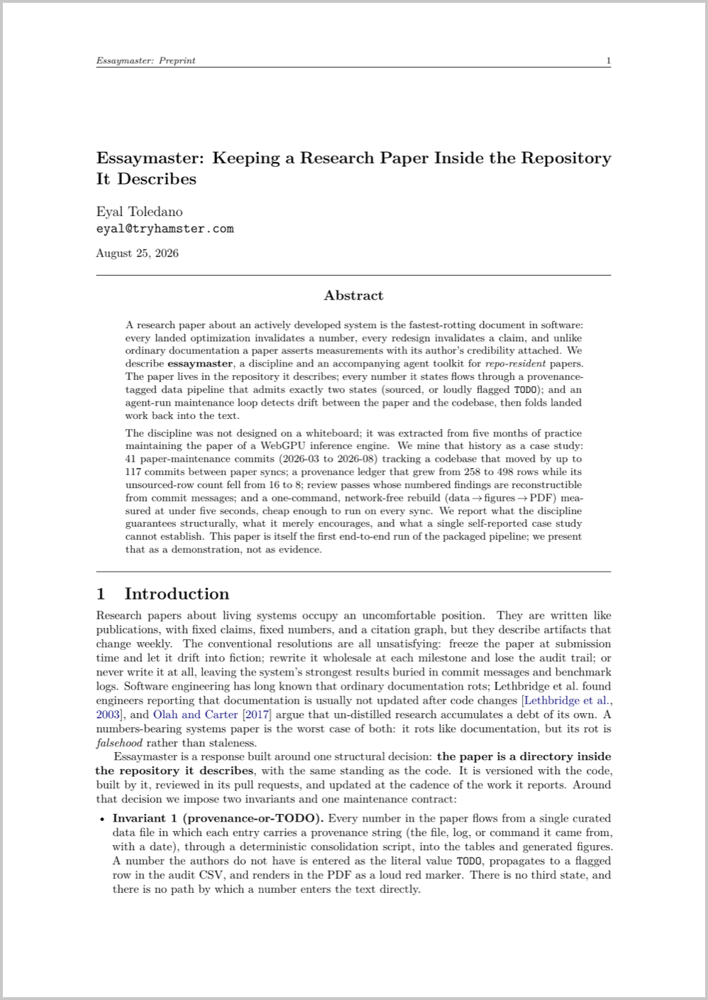

# essaymaster

Write and maintain repo-resident research papers that grow with your codebase.

**Docs:** [Getting started](docs/getting-started.md) ·
[Concepts](docs/concepts.md) · [Commands & CLI](docs/commands.md)

Extracted from the practice that produced the Gerbil WebGPU paper: a ~17-page
arXiv-grade systems paper living in `paper/` of the engine repo, kept current across
five months and 41 maintenance commits as optimization campaigns landed — every number
provenance-tagged, every citation verified, rebuilt with one command.

## The worked example: this repo's own paper

This repository maintains its own paper with the tool it packages —
[**"Essaymaster: Keeping a Research Paper Inside the Repository It
Describes"**](paper/paper.pdf) — produced as the pipeline's first end-to-end run:
a miner subagent extracted the case-study evidence from five months of the Gerbil
paper's git history, seven citations were web-verified at authoring time, an
adversarial review pass caught (among other things) the draft violating the tool's
own Invariant 1, and the fixes are in the commit history with finding ids. Its
source, provenance ledger, plan doc, and generated figures live in
[`paper/`](paper/) and [`docs/research-paper-plan.md`](docs/research-paper-plan.md);
rebuild it with `cd paper && ./build.sh`.

[](paper/paper.pdf)

## What it does

- **Mine** — point it at a repo and it surfaces the papers hiding in it: sustained
  optimization campaigns with recorded numbers, non-obvious theses in design docs,
  things you hand-built because nothing off-the-shelf fit. Ranked candidates with an
  honest evidence inventory; you pick.
- **Mine sessions** — `/paper-mine-sessions` sweeps the agent's own session
  transcripts for the material git structurally cannot show: measured dead ends that
  never got committed, multi-step diagnosis arcs, surprise results, and recurring
  patterns across sessions that add up to a thesis. Session-exclusive finds only;
  transcript numbers are treated as lab-notebook leads, never measurements of record.
- **Init** — plan doc first (verified related-work survey, claims → required-evidence
  table, figure list), then a scaffolded `paper/` with a one-command
  data → figures → PDF build (tectonic/latexmk autodetect, zero-dependency figure
  generators).
- **Sync** — the maintenance loop. `SYNC.json` tracks the last commit the paper
  absorbed and which paths it watches; a SessionStart hook prints drift ("paper is 14
  watched commits behind"); a git post-commit **capture hook** nudges in the commit
  output itself the moment landed work touches watched paths; `/paper-sync`
  classifies landed work and folds it in through the provenance pipeline. Nobody has
  to remember the paper exists.
- **Review / Publish** — adversarial review with numbered findings (overclaim hunt,
  number reconciliation, citation audit), then a verified arXiv bundle.

## Install

One line:

```bash
npx skills add eyaltoledano/essaymaster
```

Also works as a Claude Code plugin (from a marketplace that includes this repo:
`/plugin install essaymaster`), or with no install at all: mention "essaymaster" /
point Claude at `skills/essaymaster/SKILL.md` in this checkout.

Commands: `/paper-mine` `/paper-mine-sessions` `/paper-init` `/paper-sync`
`/paper-build` `/paper-review` `/paper-publish`.

## The CLI

The mechanical spine ships as a zero-dependency CLI inside the skill folder itself
(`skills/essaymaster/bin/essaymaster.mjs`), so any install method that delivers the
skill delivers the CLI with it — the skill routes every mechanical step through it,
with no "if missing" fallback:

```
essaymaster drift        # how far each paper lags HEAD (--json for agents)
essaymaster init         # scaffold + sync pointer + capture hook
essaymaster migrate <s>  # paper/ -> papers/<slug>/, history-preserving
essaymaster check        # lint the invariants — pre-commit and CI gate (exit 1 on fail)
essaymaster sync-done    # advance the sync pointer (refuses if tex newer than PDF)
essaymaster bundle       # build + assemble + verify the arXiv bundle
essaymaster hooks install
```

Judgment (mining, classification, writing, review) stays with the agent; the CLI owns
state transitions and verification. Papers still build standalone (`paper/build.sh`)
— the CLI wraps checks around the vendored build, never replaces it. Wire
`essaymaster check` into CI and the paper has tests.

## Disclosure

Not all work becomes a paper, and not every paper becomes public. Mined candidates
carry a Disclosure rating (public / needs-clearance / internal-only); internal-only
material never enters a publishable paper without the owner's explicit decision, and
session-transcript finds inherit the rating of the work they concern. Internal
whitepapers in private repos are a first-class target — publication is a separate
step, gated in `/paper-publish` and `essaymaster bundle`.

## The two invariants

1. **Provenance or TODO.** Every number in a paper traces to a row in
   `results/measurements.csv` with a source string, or is flagged `TODO` in the data
   and rendered as a loud red `\todo{}` in the PDF. No third state.
2. **Honesty is structural.** Unrun measurements are declared in the paper itself and
   get a runbook doc so anyone can close them later. Negative results are findings.

## Layout

```
skills/essaymaster/      the whole skill, self-contained:
  SKILL.md + references/   (mining, session-mining, planning, provenance,
                            citations, writing, maintenance, toolchain, figures)
  bin/essaymaster.mjs      the CLI (zero-dependency; state transitions + verification)
  scripts/                 check-toolchain.sh, paper-drift.sh, paper-post-commit.sh +
                           install-git-hook.sh (the commit-time capture hook)
  templates/paper/         the scaffold: build.sh, Makefile, arxiv.sty, paper.tex
                           skeleton, refs.bib, data/results/figures pipeline, SYNC.json
commands/                /paper-* slash commands
agents/                  paper-miner (repo scout), session-miner (transcript scout),
                         paper-reviewer (adversarial)
hooks/hooks.json         SessionStart drift report (silent when no paper / no drift)
```
